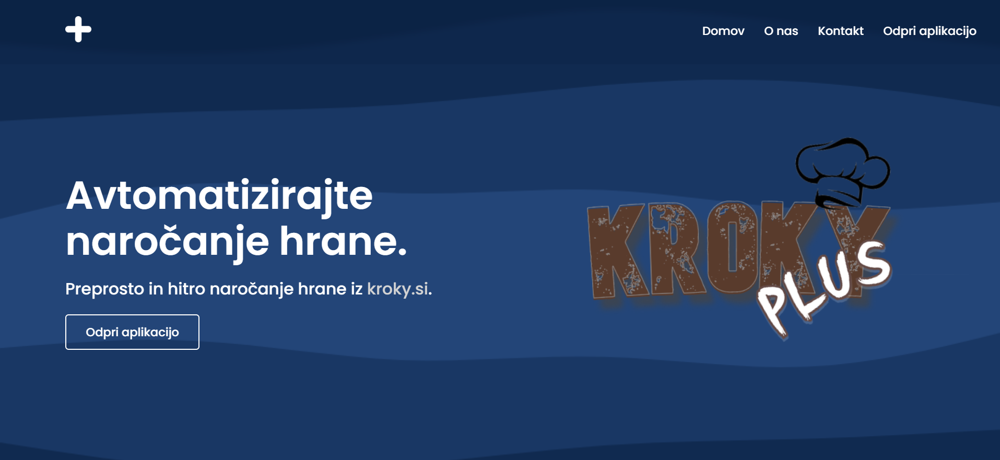
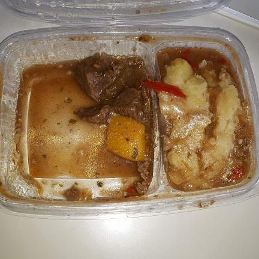
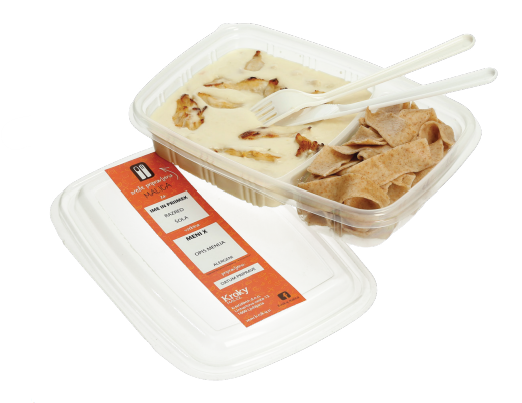
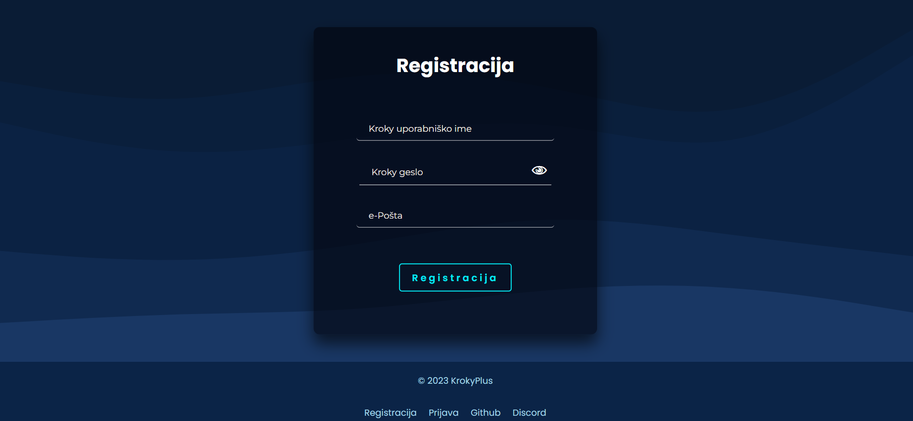
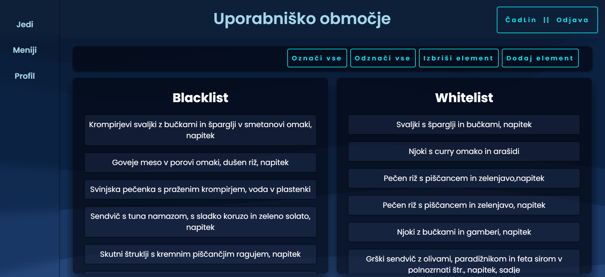
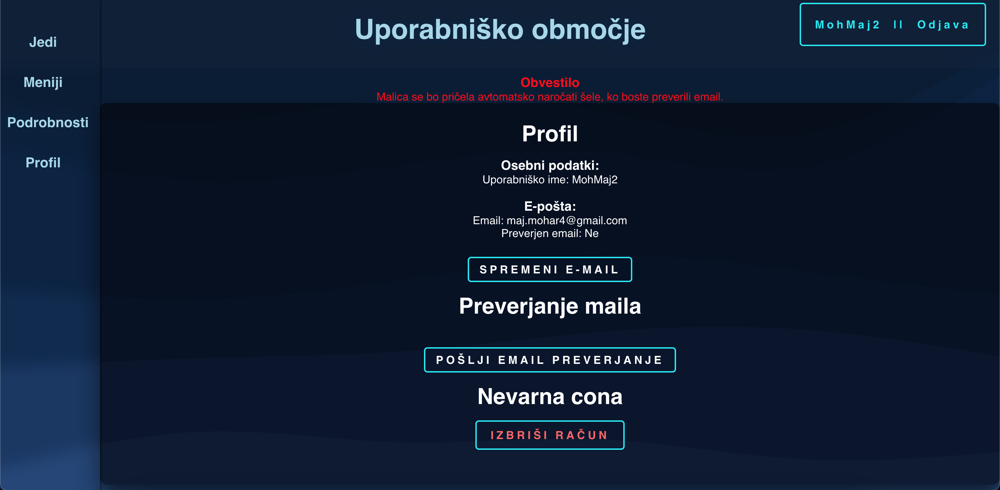
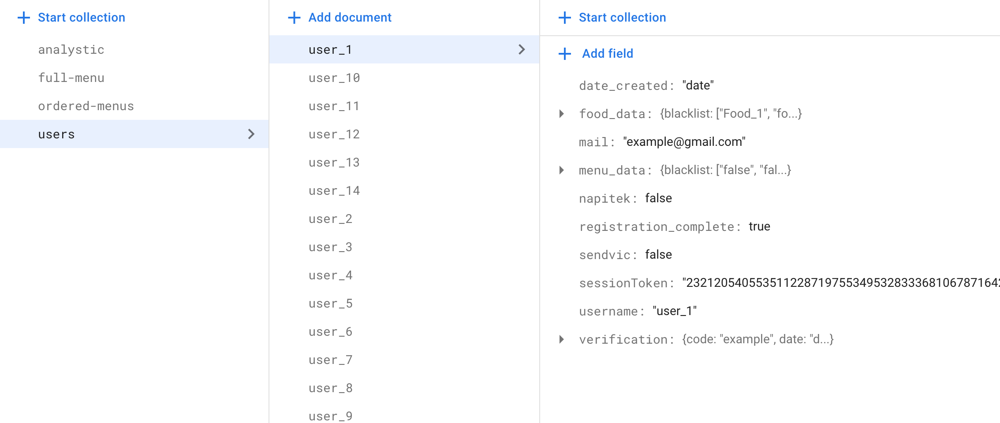
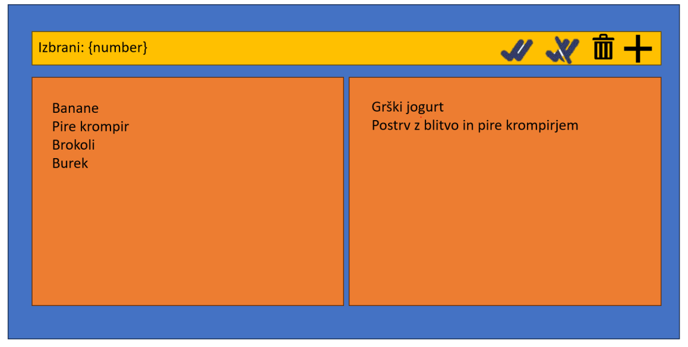
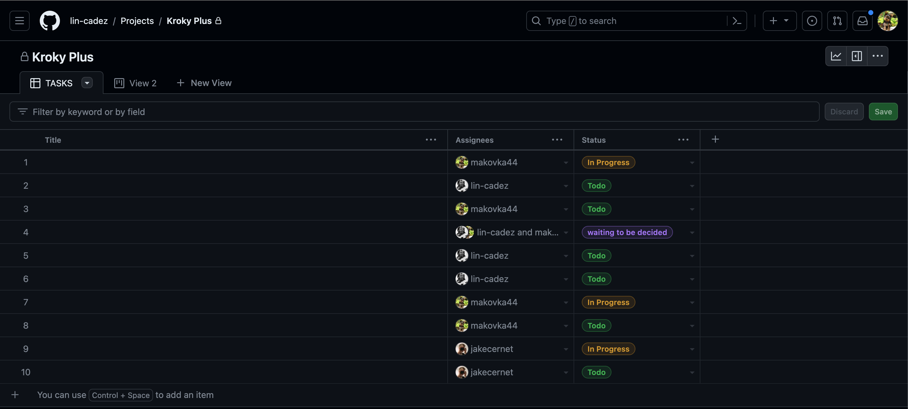

# 🥕 **Kroky Plus**

<h3><strong>Kroky Plus</strong> is a web app for the <strong>automation</strong> of weekly school snack ordering from <a href="https://www.kroky.si/2016/?mod=register&action=order">kroky.si</a></h3>



## **💡 Getting the Idea**

I found myself often forgetting to order school snacks for next week so I was left with something like this:
<br>

<br>
<br>
But I knew I could have something like that:
<br>

<br>
Something had to be done... So here is **Kroky Plus ➕**

## 🛠️ **The Inner Workings of Kroky Plus**

1. 📝 **Simple Registration Process**: Begin by registering using the credentials provided by Kroky at your school.

   - These credentials allow the algorithm to access your account and gather data on your past orders. 

2. 🌟 **Personalized User Area**: Once registered, access your user area to input data that will fine-tune menu recommendations. Share your favorite and least favorite menus, meals, and drinks.
   
   
   

3. 💌 **Weekly Confirmation and Selection**: Each week, you'll receive a confirmation email containing the recommended meals.

## 🧠 **The Algorithm Behind Kroky Plus**

Curious about how the algorithm works? Let's dive into the technical aspects:

### 1. **Algorithm Workflow**:

- The algorithm commences by blending past order data, stored as a Firebase dictionary, with your input.
- The steps include:
  1. **Getting the Next Week's Menu**: It retrieves the menu for the upcoming week.
  2. **Iterating Through Days**: The algorithm iterates through each day.
  3. **Analyzing Daily Menus**: It reviews all 10 menus available for a given day.
  4. **Initial Meal Scores**: Each meal starts with a score of 100.
  5. **Considering User Preferences**: The algorithm checks the user's blacklisted and whitelisted meals.
  6. **Adjusting Scores**: If a meal is blacklisted, its score is halved; if whitelisted, it's doubled.
  7. **Comparing to Previous Orders**: It compares these scores to data from previous orders, if available.
  8. **Scoring Based on History**: Meals that appeared frequently in past orders are assigned a score based on the number of times they've been ordered before.
  9. **Incorporating Menu Preferences**: Afterward, the algorithm factors in the menu blacklist and whitelist, adjusting the scores accordingly.
  10. **Accounting for Drink Preferences**: Scores are doubled for preferred drinks and halved for non-preferred drinks.
  11. **Selecting the Top Choice**: Finally, the algorithm sorts the dictionary and selects the item with the highest score.
  12. **Sending Requests and Confirmation**: It makes an API request to the kroky.si server and sends a confirmation email.

### 2. **Refining Data for Enhanced Accuracy**:

- To illustrate, let's use an example menu:
  ```
  BAKED RICE WITH VEGETABLES, DRINK
  ```

The data refinement process unfolds as follows:

1.  Drink-related terms are omitted for clarity:
    ```
    BAKED RICE WITH  VEGETABLES
    ```
2.  The menu is tokenized:
    ```
    [BAKED, RICE, WITH, VEGETABLES]
    ```
3.  Conjunctions are removed:
    ```
    [BAKED, RICE, VEGETABLES]
    ```
4.  The refined data is compiled into a dictionary stored in the database.
    
    Password are held secure in other, more secure way on the server. In analystic, we save just the infromations like, the usage of the webpage and the number of users. Then in full-menu we have full menu for programe to chose from. And the last one, ordered-menus, is for you to see which menus you chose.

## 🎨 **A Focus on User Experience Design**

Our design journey aimed to create a seamless experience for users:

- The design, primarily shaped by [Jakecer](https://github.com/jakecernet), is optimized for desktop and potential mobile adaptation.
- Initially, an early prototype featured a drag-and-drop meal selection system (see Early Prototype image below).
- This evolved into a more intuitive model with a user-friendly interface (see Final Design image below).

_Early Prototype_:



_Final Design_:


## 👥 **Team Collaboration and Roles**

For collaboration, we used GitHub Projects. It's a great application because it allows clear and transparent task assignment.


Our project was a collaboration among three developers:

- Lin Cadez implemented logic
- Jaka Cernetic was lead designer
- Maj Mohar helped with logic, basics of Firebase

## 🏁 **Summing It Up**

That is all....

_Enjoy delicious school snacks chosen by Kroky Plus! 🥪🎉_
